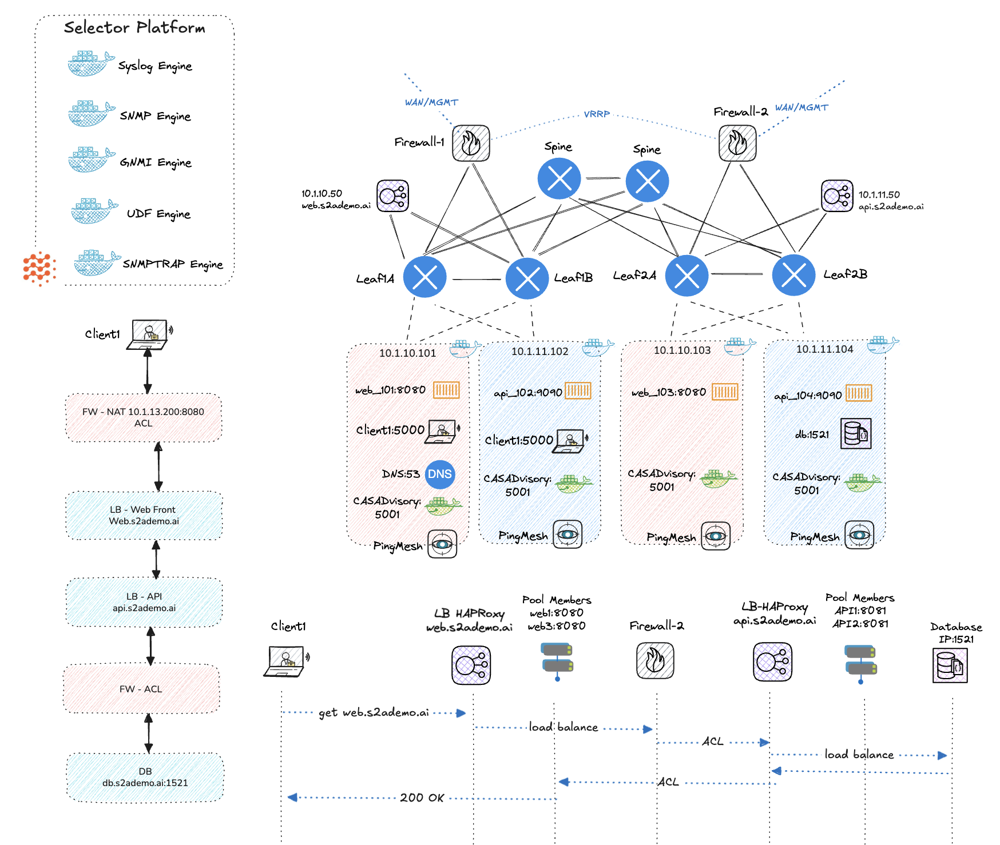

# Enterprise Demo Lab



## Overview

This is a comprehensive enterprise network lab that demonstrates a data center fabric topology using Arista cEOS switches with Ansible automation. The lab includes spine-leaf architecture, VyOS firewalls, HAProxy load balancers, and containerized services to simulate real-world enterprise networking scenarios.

## Network Topology

The lab deploys a complete data center environment with:

### Core Components
- **2 Spine Switches** (DC1_SPINE1, DC1_SPINE2)
- **4 Leaf Switches** (DC1_LEAF1A, DC1_LEAF1B, DC1_LEAF2A, DC1_LEAF2B)
- **4 Client Nodes** (DC1_CLIENT1-4) with LACP bonding
- **2 VyOS Firewalls** (DC1_VYOS01, DC1_VYOS02)
- **2 HAProxy Load Balancers** (DC1_HAPROXY1, DC1_HAPROXY2)

### Network Architecture
- **Spine-Leaf Topology**: Each leaf connects to both spines for redundancy
- **MLAG Pairs**: Leaf switches are paired (1A-1B, 2A-2B) for high availability
- **Client Connectivity**: Dual-homed clients with LACP across MLAG pairs
- **Management Network**: 172.100.100.0/24 for out-of-band management

## Prerequisites

### Software Requirements
- **ContainerLab** (latest version)
- **Ansible** with required collections
- **Docker** (for containerized services)
- **Python 3** with required libraries

### Images Required
- `sebbycorp/ceosimage:4.33.4M` - Arista cEOS switches
- `alpine-demo` - Linux client nodes
- `muruu1/vyos:latest` - VyOS firewalls
- `nicholasjackson/fake-service:v0.7.1` - Demo services

### System Requirements
- Linux system with Docker support
- Sudo privileges
- Minimum 16GB RAM recommended
- 50GB free disk space

## Quick Start

### 1. Deploy the Complete Lab

```bash
# Navigate to the lab directory
cd lab-enterprise

# Option 1: Using the build script
./build.sh

# Option 2: Using Make
make deploy

# Option 3: Manual deployment
sudo containerlab deploy -t topology.yaml
ansible-playbook playbooks/superbook.yaml
./services/serverbuild.sh
./services/deploy-apps.sh
./traffic/traffic.sh
```

### 2. Verify Deployment

```bash
# Check topology status
sudo containerlab inspect -t topology.yaml

# Verify Ansible connectivity
ansible all -i inventory.yaml -m ping
```

### 3. Access the Lab

- **ContainerLab Management**: `http://localhost:8080`
- **Switch Management**: SSH to management IPs (172.100.100.2-7)
- **Service Access**: Various ports on client nodes

## Deployment Process

The deployment follows these automated steps:

1. **Container Deployment**: ContainerLab spins up all network devices
2. **Network Configuration**: Ansible applies switch configurations
3. **Service Deployment**: Docker services are deployed on client nodes
4. **Traffic Generation**: Automated traffic flows are initiated

## Services Deployed

The lab includes several demo services:

### Database Service
- **Port**: 1521
- **Service**: Oracle DB simulator
- **Location**: Client nodes

### API Service
- **Port**: 9090
- **Service**: Payment API simulator
- **Upstream**: Database service

### Web Frontend
- **Port**: 9091
- **Service**: Web frontend simulator
- **Upstream**: API service

### Client Services
- **Ports**: 9001, 9004
- **Service**: Client simulators
- **Purpose**: Generate traffic and demonstrate connectivity

## Configuration Management

### Ansible Playbooks
- `playbooks/superbook.yaml` - Main deployment playbook
- `playbooks/fabric-deploy-config.yaml` - Fabric configuration
- `playbooks/firewall.yaml` - Firewall configuration
- `playbooks/haproxynet.yaml` - HAProxy configuration
- `playbooks/network-changes.yaml` - Network modifications

### Configuration Variables
Located in `group_vars/`:
- `AVD_LAB.yaml` - Lab-wide settings
- `DC1_FABRIC.yaml` - Fabric configuration
- `DC1_LEAFS.yaml` - Leaf switch settings
- `DC1_SPINES.yaml` - Spine switch settings
- `DC1_NETWORK_SERVICES.yaml` - Network services
- `DC1_CONNECTED_ENDPOINTS.yaml` - Endpoint definitions
- `VYOS_FIREWALLS.yml` - Firewall configurations

## Traffic Generation

The lab includes automated traffic generation:

```bash
# Start traffic generation
./traffic/traffic.sh

# DNS query testing
python3 traffic/dns_query_loop.py
```

## Management and Monitoring

### Device Access
- **Switch CLI**: `ssh admin@172.100.100.X` (admin/admin)
- **VyOS CLI**: `ssh vyos@172.100.100.1[2-3]` (vyos/vyos)
- **Container Access**: `docker exec -it <container> /bin/bash`

### Monitoring
- **SNMP**: Enabled on HAProxy nodes
- **Logs**: Service logs in respective containers
- **ContainerLab**: Built-in topology visualization

## Troubleshooting

### Common Issues

1. **Deployment Failures**
   ```bash
   # Check container status
   sudo containerlab inspect -t topology.yaml
   
   # Review logs
   docker logs <container_name>
   ```

2. **Ansible Connectivity**
   ```bash
   # Test connectivity
   ansible all -i inventory.yaml -m ping
   
   # Check SSH access
   ssh admin@172.100.100.2
   ```

3. **Service Issues**
   ```bash
   # Check service status
   docker ps -a
   
   # Review service logs
   docker logs <service_name>
   ```

## Cleanup

### Destroy the Lab

```bash
# Navigate to the lab directory
cd lab-enterprise

# Option 1: Using the destroy script
./destroy.sh

# Option 2: Using Make
make destroy

# Option 3: Manual cleanup
sudo containerlab destroy -t topology.yaml --cleanup
```

### Complete Cleanup

```bash
# Remove all generated files
rm -rf .topology.yaml.bak config_backup/ snapshots/ reports/ documentation/ intended/

# Remove Docker containers
docker container prune -f

# Remove unused images
docker image prune -f
```

## File Structure

```
enterprise-demo-lab/
├── README.md                # This file
├── lab-enterprise/          # Main lab directory
│   ├── build.sh             # Main deployment script
│   ├── destroy.sh           # Cleanup script
│   ├── Makefile             # Make targets for deployment
│   ├── topology.yaml        # ContainerLab topology definition
│   ├── inventory.yaml       # Ansible inventory
│   ├── ansible.cfg          # Ansible configuration
│   ├── diagram.png          # Network topology diagram
│   ├── playbooks/           # Ansible playbooks
│   ├── group_vars/          # Ansible variables
│   ├── templates/           # Configuration templates
│   ├── services/            # Service deployment scripts
│   ├── traffic/             # Traffic generation scripts
│   ├── haproxy/             # HAProxy configurations
│   └── clab-s2/             # ContainerLab generated files
└── alpine-demo/             # Alpine Linux demo container
```

## Advanced Usage

### Custom Configurations
- Modify `group_vars/` files for custom network settings
- Update `topology.yaml` to add/remove nodes
- Customize service configurations in `services/`

### Development
- Use `ansible-playbook` with specific tags
- Deploy individual services using scripts in `services/`
- Test network changes with `playbooks/network-changes.yaml`

## Support

For issues or questions:
1. Check the troubleshooting section
2. Review container logs
3. Verify prerequisites are met
4. Ensure proper network connectivity

## License

This lab is provided for educational and testing purposes. Please review the licensing terms for all included container images and software components.
