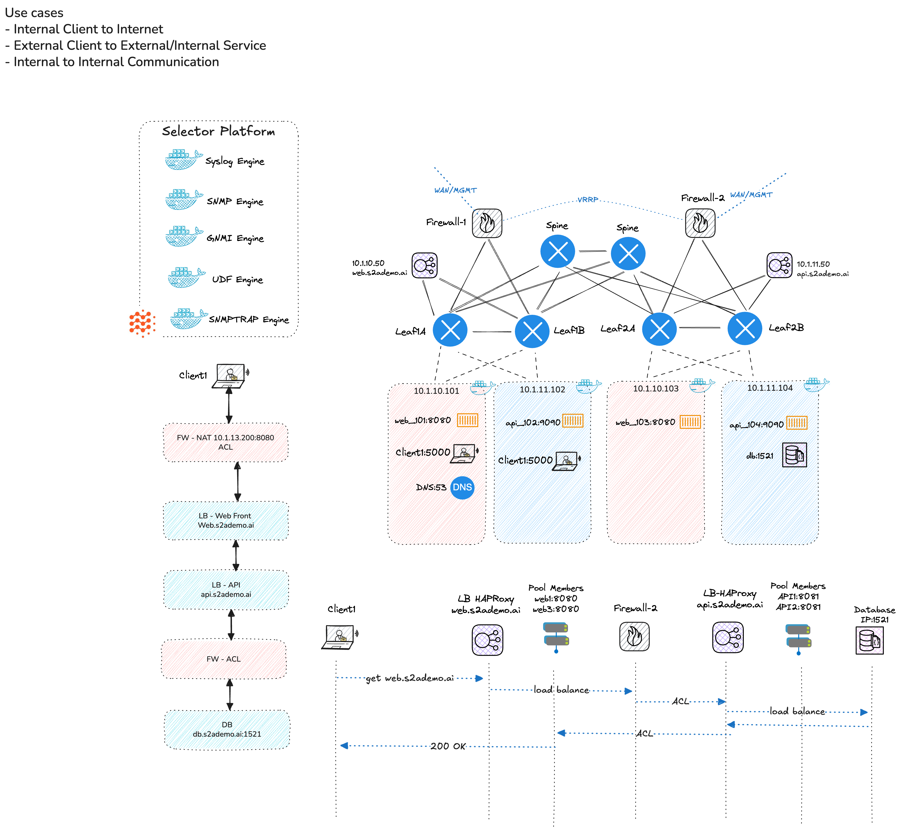

# Enterprise GCP Demo Lab - Deployment Guide

## Overview
This deployment guide provides step-by-step instructions for setting up the Enterprise GCP Demo Lab on Ubuntu servers in GKE. The lab deploys a comprehensive enterprise network simulation with Arista cEOS switches, VyOS firewalls, HAProxy load balancers, and containerized services.



## System Requirements
- Ubuntu 20.04 LTS or later
- Minimum 16GB RAM (32GB recommended)
- 50GB free disk space
- Docker support
- Sudo privileges
- Internet connectivity for downloading packages and container images

## Prerequisites Installation (Note if you have them then skip to step ## Pre-Deployment Setup )

### 1. Update System Packages
```bash
sudo apt update && sudo apt upgrade -y
```

### 2. Install Essential Tools 
```bash
sudo apt install -y \
    curl \
    wget \
    git \
    jq \
    python3 \
    python3-pip \
    python3-venv \
    software-properties-common \
    apt-transport-https \
    ca-certificates \
    gnupg \
    lsb-release
```

### 3. Install Docker
```bash
# Add Docker's official GPG key
curl -fsSL https://download.docker.com/linux/ubuntu/gpg | sudo gpg --dearmor -o /usr/share/keyrings/docker-archive-keyring.gpg

# Add Docker repository
echo "deb [arch=$(dpkg --print-architecture) signed-by=/usr/share/keyrings/docker-archive-keyring.gpg] https://download.docker.com/linux/ubuntu $(lsb_release -cs) stable" | sudo tee /etc/apt/sources.list.d/docker.list > /dev/null

# Install Docker
sudo apt update
sudo apt install -y docker-ce docker-ce-cli containerd.io docker-compose-plugin

# Add user to docker group
sudo usermod -aG docker $USER

# Start and enable Docker service
sudo systemctl start docker
sudo systemctl enable docker

# Verify Docker installation
docker --version
```

### 4. Install Containerlab
```bash
# Download and install containerlab
bash -c "$(curl -sL https://get.containerlab.dev)"

# Verify installation
containerlab version
```

### 5. Install Ansible and Required Collections
```bash
# Install Ansible
sudo apt install -y ansible

# Install Python dependencies for Ansible
pip3 install --user \
    ansible \
    jinja2 \
    netaddr \
    paramiko \
    requests \
    urllib3

# Install required Ansible collections
ansible-galaxy collection install \
    vyos.vyos \
    arista.eos \
    community.general \
    ansible.posix

# Verify Ansible installation
ansible --version
```

### 6. Install Additional Python Dependencies
```bash
# Install Python packages needed for the lab
pip3 install --user \
    docker \
    pyyaml \
    jsonschema \
    requests \
    ipaddress
```

## Pre-Deployment Setup

### 1. Clone the Repository
```bash
git clone https://github.com/sebastian-s2/enterprise-demo-lab/
cd enterprise-demo-lab/lab-gcp
```

### 2. Edit Topology Environment Variables
edit the `topology.yaml` file to set your environment variables. You can use the default values or customize them as needed.

example below 10.143.64.154 is my gcp server IP address, change it to your own server IP address.
```yaml
      env:
        PRIMARY_DNS: ${PRIMARY_DNS:-10.1.10.101}
        SECONDARY_DNS: ${SECONDARY_DNS:-8.8.8.8}
        SNMP_STRING: ${SNMP_STRING:-public}
        LOGGING_SERVER: ${LOGGING_SERVER:-10.143.64.154}
        OWNER: ${OWNER:-sebastianm@selector.ai}
        DATACENTER_LOCATION: ${DATACENTER_LOCATION:-New York Data Center}
```
      
### 3. Make Scripts Executable
```bash
chmod +x build.sh
chmod +x destroy.sh
chmod +x services/serverbuild.sh
chmod +x traffic/traffic.sh
```


## Deployment Process

### 1. Run the Main Deployment Script
```bash
./build.sh
```

Note: You will need to provide the IP address of the logging server for the firewall to send logs too just type you GCP server IP address when prompted..

### 2. What the build.sh Script Does

The script performs the following operations:

1. **Deploys Containerlab Topology**: Creates a network of Arista cEOS switches, VyOS firewalls, and Alpine Linux clients
2. **Configures Firewalls**: Runs Ansible playbooks to configure VyOS firewalls with:
   - Syslog configuration
   - SNMP monitoring
   - LLDP protocol
   - Bonding interfaces
   - VLAN configuration
3. **Starts Kasm Desktop**: Launches a containerized desktop environment accessible via web browser
4. **Builds Servers**: Configures client nodes with:
   - VLAN interfaces
   - Network routing
   - DNS configuration
   - Docker daemon startup
5. **Deploys Applications**: Sets up DNS services and application containers
6. **Starts Traffic Generation**: Initiates network traffic simulation using iperf3 and HTTP requests

### 3. Access Points

After successful deployment, you'll have access to:

- **Kasm Desktop**: http://<gcp IP>>:6901 (username:kasm_user password: mypassword)
- **Network Management**: Switch management interfaces on 172.100.100.x network
- **DNS Server**: Available at 172.100.100.8:5380
- **CLIENT traffic starts at**: Available at http://172.100.100.8:5000
- **Load Balancers**: HAProxy instances for traffic distribution

## Troubleshooting

### Common Issues and Solutions

1. **Docker Permission Denied**
   ```bash
   # Logout and login again, or run:
   newgrp docker
   ```

2. **Containerlab Not Found**
   ```bash
   # Re-run the installation command
   bash -c "$(curl -sL https://get.containerlab.dev)"
   ```

3. **Ansible Collection Missing**
   ```bash
   # Install missing collections
   ansible-galaxy collection install vyos.vyos
   ansible-galaxy collection install arista.eos
   ```

4. **Container Image Pull Failures**
   ```bash
   # Check internet connectivity and try again
   docker pull sebbycorp/ceosimage:4.33.4M
   ```

5. **Insufficient Resources**
   - Ensure at least 16GB RAM is available
   - Check disk space with `df -h`
   - Monitor resource usage with `htop`

## Stopping the Lab

To stop and clean up the lab environment:

```bash
./destroy.sh
```

This will:
- Stop all running containers
- Remove the containerlab topology
- Clean up network configurations

## Network Architecture

The lab creates the following network topology:

- **Spine Switches**: 2x Arista cEOS spine switches (DC1_SPINE1, DC1_SPINE2)
- **Leaf Switches**: 4x Arista cEOS leaf switches in 2 pairs (DC1_LEAF1A/1B, DC1_LEAF2A/2B)
- **Firewalls**: 2x VyOS firewalls (VYOS01, VYOS02)
- **Clients**: 4x Alpine Linux clients for traffic generation
- **Services**: DNS, HAProxy, and application containers

## Support

For issues or questions:
1. Check the logs: `docker logs <container-name>`
2. Verify network connectivity: `docker exec <container> ping <target>`
3. Review Ansible output for configuration errors
4. Ensure all prerequisites are properly installed

## Security Considerations

- Default credentials are used for demonstration purposes
- Change default passwords in production environments
- Review firewall rules before deployment
- Ensure proper network isolation in production

---

This deployment guide provides a complete setup process for the Enterprise GCP Demo Lab. Follow each step carefully to ensure a successful deployment. 